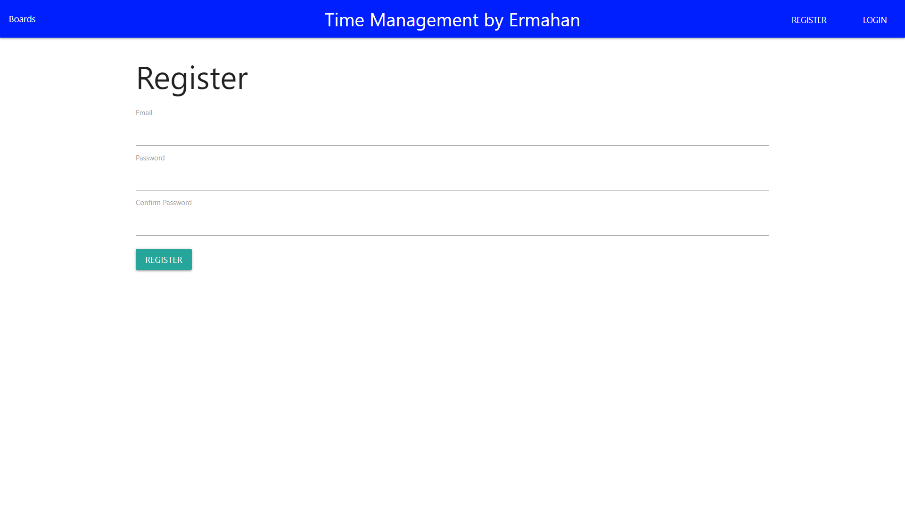
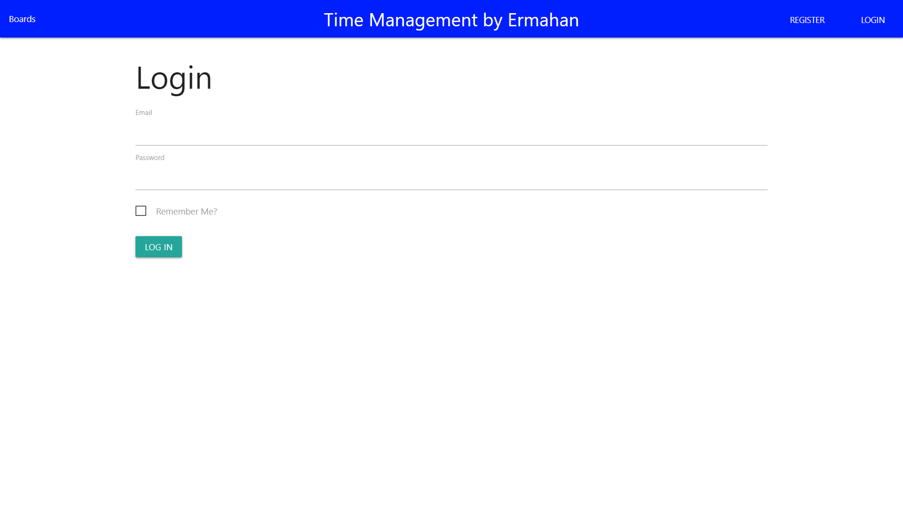
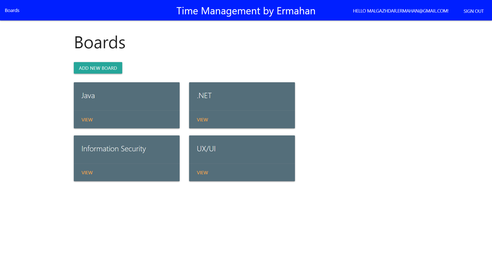
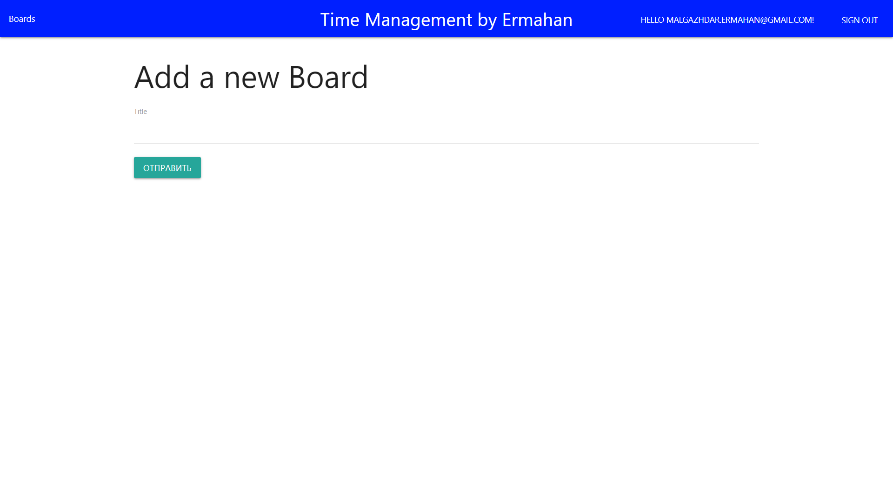
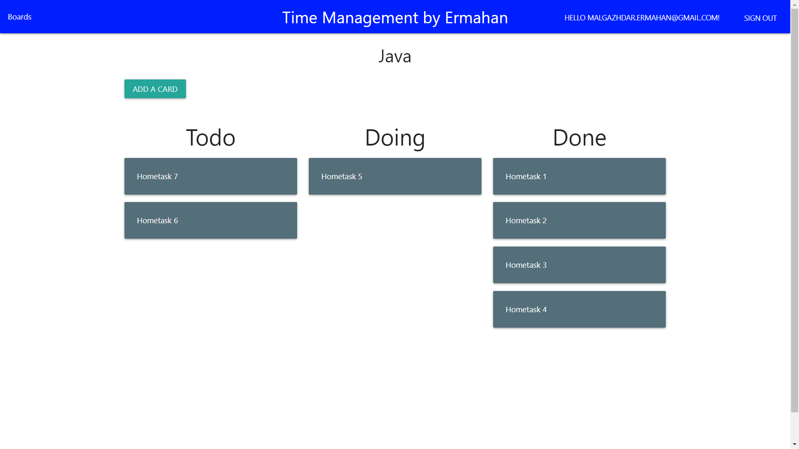
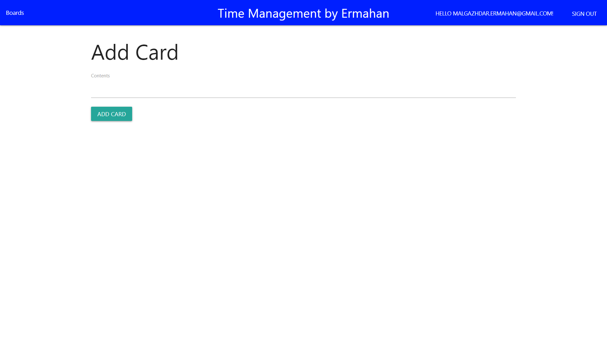
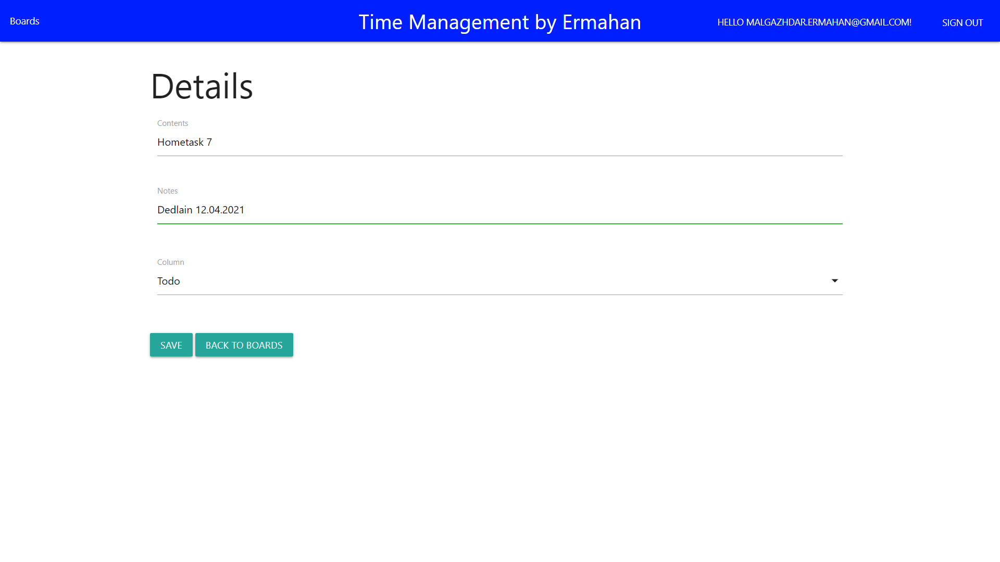

## Time Management
*Group:* ***CSSE-1804K*** 

*Student:* ***Nurgazy Ermahan***

*Discepline:* ***.NET Application***

## Introduction
Time Management is an analogue of Trello's project, it helps people to distribute their affairs correctly, and thereby affects a person's productivity.

## Screenshots
- Main page

- Register page

- Login page

- After Sign In page

- Add Board page

- Cards page

- Add Card page

- Card Deatils page

